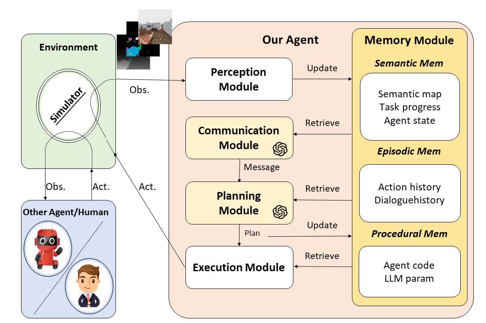
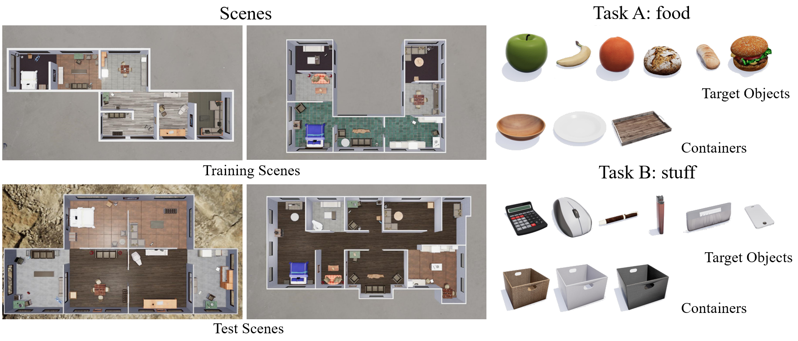

# Building Cooperative Embodied Agents Modularly with Large Language Models (ICLR 2024)

This repo contains codes for the following paper:

_Hongxin Zhang*, Weihua Du*, Jiaming Shan, Qinhong Zhou, Yilun Du, Joshua B. Tenenbaum, Tianmin Shu, Chuang Gan_: Building Cooperative Embodied Agents Modularly with Large Language Models 

Paper: [Arxiv](https://arxiv.org/abs/2307.02485)

Project Website: [Co-LLM-Agents](https://vis-www.cs.umass.edu/Co-LLM-Agents/)



## News

**[8/25/2024]**: Updates on the navigation module of agents on the `ThreeDWorld Multi-Agent Transport` environment to fix the navigation issues.

**[9/4/2023]**: `ThreeDWorld Multi-Agent Transport` no longer provides ground truth segmentation mask in default. We implement a vision detection module with a fine-tuned Mask-RCNN model. For more details, please read [README](tdw_mat/README.md) in _tdw_mat_.

**[8/1/2023]**: We provide the VirtualHome Simulator executable we used [here](https://drive.google.com/file/d/1JTrV5jdF-LQVwY3OsV3Jd3r6PRghyHBp/view?usp=sharing). If you met `XDG_RUNTIME_DIR not set in the environment` error previously, please check if you are using the new version we provided.

## Installation

For detailed instructions on the installation of the two embodied multi-agent environments `Communicative Watch-And-Help` and `ThreeDWorld Multi-Agent Transport`, please refer to the Setup sections in `cwah/README.md` and `tdw_mat/README.md` respectively.

### A simple start guide for `ThreeDWorld Multi-Agent Transport`:

Run the following commands step by step to set up the environments:

```bash
cd tdw_mat
conda create -n tdw_mat python=3.9
conda activate tdw_mat
pip install -e .
```

If you're running TDW on a remote Linux server, follow the [TDW Installation Document](https://github.com/threedworld-mit/tdw/blob/master/Documentation/lessons/setup/install.md) to configure the X server.

After that, you can run the demo scene to verify your setup:

```bash
python demo/demo_scene.py
```

### A simple start guide for `Communicative Watch-And-Help`:

**Step 1**: Get the VirtualHome Simulator and API and put it at the same level as the `cwah` folder.

Clone the [VirtualHome API](https://github.com/xavierpuigf/virtualhome.git) repository:

```bash
git clone --branch wah https://github.com/xavierpuigf/virtualhome.git
```

Download the [Simulator](https://drive.google.com/file/d/1L79SxE07Jt-8-_uCvNnkwz5Kf6AjtaGp/view?usp=sharing) (Linux x86-64 version), and unzip it.

```bash
gdown https://drive.google.com/uc?id=1L79SxE07Jt-8-_uCvNnkwz5Kf6AjtaGp
unzip executable.zip
chmod +x executable/linux_exec.v2.3.0.x86_64
```

The files should be organized as follows:

```bash
|--cwah/
|--virtualhome/
|--executable/
```

**Step 2**: Install Requirements
```bash
cd cwah
conda create --name cwah python=3.8
conda activate cwah
pip install -r requirements.txt
```

## Run Experiments

The main implementation code of our _CoELA_ is in `tdw_mat/LLM` and `tdw_mat/tdw_gym/lm_agent.py`.

We also prepare example scripts to run experiments with HP baseline and our _CoELA_ under the folder `tdw_mat/scripts`.

For example, to run experiments with two _CoELA_ on `ThreeDWorld Multi-Agent Transport`, run the following command in folder `tdw_mat`.

```
./scripts/test_LMs-gpt-4.sh
```

## Environment Details

### ThreeDWorld Multi-Agent Transport (TDW-MAT)

We extend the [ThreeDWorld Transport Challenge](https://arxiv.org/abs/2103.14025) into a multi-agent setting with more types of objects and containers, more realistic object placements, and support communication between agents, named ThreeDWorld Multi-Agent Transport (TDW-MAT), built on top of the [TDW platform](https://www.threedworld.org/). 

The agents are tasked to transport as many target objects as possible to the goal position with the help of containers as tools. One container can carry most three objects, and without containers, the agent can transport only two objects at a time. The agents have the ego-centric visual observation and action space as before with a new communication action added.

#### Tasks 

We selected $6$ scenes from the TDW-House dataset and sampled $2$ types of tasks and $2$ settings in each of the scenes, making a test set of $24$ episodes. Every scene has $6$ to $8$ rooms, $10$ objects, and a few containers. An episode is terminated if all the target objects have been transported to the goal position or the maximum number of frames ($3000$) is reached. 

The tasks are named `food task` and `stuff task`. Containers for the `food task` can be found in both the kitchen and living room, while containers for the `stuff task` can be found in the living room and office. 

The configuration and distribution of containers vary based on two distinct settings: the `Enough Container Setting` and the `Rare Container Setting`. In the `Enough Container Setting`, the ratio of containers to objects stands at $1:2$, and containers associated with a specific task are located in no more than two rooms. On the other hand, in the `Rare Container Setting`, the container-to-object ratio decreases to $1:5$. This distribution differs from the "Enough Container Setting" as containers in the `Rare Container Setting` are strictly localized to a single room. 

One example of scenes, target objects, and containers is shown in the following image:



#### Metrics

  - **Transport Rate (TR)**: The fraction of the target objects successfully transported to the goal position.
  - **Efficiency Improvements (EI)**: The efficiency improvements of cooperating with base agents.

### Communicative Watch-And-Help (C-WAH)

Communicative Watch-And-Help(C-WAH) is an extension of the [Watch-And-Help challenge](https://github.com/xavierpuigf/watch_and_help), which enables agents to send messages to each other. Sending messages, alongside other actions, takes one timestep and has an upper limit on message length.

#### Tasks 

Five types of tasks are available in C-WAH, named `Prepare afternoon tea`, `Wash dishes`, `Prepare a meal`, `Put groceries`, and `Set up a dinner table`. These tasks include a range of housework, and each task contains a few subgoals, which are described by predicates. A predicate is in `ON/IN(x, y)` format, that is, `Put x ON/IN y`. The detailed descriptions of tasks are listed in the following table:

| Task Name | Predicate Set |
| ------- | ------- |
| Prepare afternoon tea   | ON(cupcake,coffeetable), ON(pudding,coffeetable), ON(apple,coffeetable), ON(juice,coffeetable), ON(wine,coffeetable)  |
| Wash dishes  | IN(plate,dishwasher), IN(fork,dishwasher)  |
| Prepare a meal | ON(coffeepot,dinnertable),ON(cupcake,dinnertable), ON(pancake,dinnertable), ON(poundcake,dinnertable), ON(pudding,dinnertable), ON(apple,dinnertable), ON(juice,dinnertable), ON(wine,dinnertable) |
|Put groceries | IN(cupcake,fridge), IN(pancake,fridge), IN(poundcake,fridge), IN(pudding,fridge), IN(apple,fridge), IN(juice,fridge), IN(wine,fridge) |
|Set up a dinner table | ON(plate,dinnertable), ON(fork,dinnertable) |

The task goal is to satisfy all the given subgoals within $250$ time steps, and the number of subgoals in each task ranges from $3$ to $5$. 

#### Metrics

  - **Average Steps (L)**: Number of steps to finish the task;
  - **Efficiency Improvement (EI)**: The efficiency improvements of cooperating with base agents.


## Interesting Cases

We noticed many interesting agents' behaviors exhibited in our experiments and identified several cooperative behaviors.

There are more interesting cases and demos on our [website](https://vis-www.cs.umass.edu/Co-LLM-Agents/)!


## Citation
If you find our work useful, please consider citing:
```
@article{zhang2024building,
  title={Building Cooperative Embodied Agents Modularly with Large Language Models},
  author={Zhang, Hongxin and Du, Weihua and Shan, Jiaming and Zhou, Qinhong and Du, Yilun and Tenenbaum, Joshua B and Shu, Tianmin and Gan, Chuang},
  journal={ICLR},
  year={2024}
}
```
