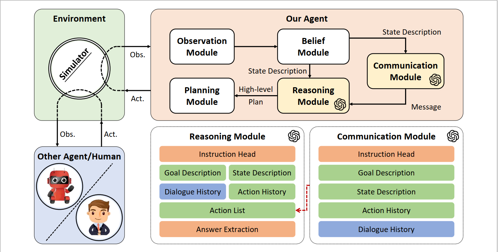

# Building Cooperative Embodied Agents Modularly with Large Language Models

This repo contains codes for the following paper:

_Hongxin Zhang*, Weihua Du*, Jiaming Shan, Qinhong Zhou, Yilun Du, Joshua B. Tenenbaum, Tianmin Shu, Chuang Gan_: Building Cooperative Embodied Agents Modularly with Large Language Models 

Paper: [Arxiv](https://arxiv.org/abs/2307.02485)

Project Website: [Co-LLM-Agents](https://vis-www.cs.umass.edu/Co-LLM-Agents/)



## News

**[9/4/2023]**: We add the vision detection module in `ThreeDWorld Multi-Agent Transport` with a fine-tuned Resnet model. Now, the environment supports both ground truth segmentation and vision detection versions. If you want to use it, please take a look at the [README](envs/tdw_mat/README.md) in tdw_mat for a detailed description.

**[8/1/2023]**: We update the VirtualHome Simulator executable we used [here](https://drive.google.com/file/d/1JTrV5jdF-LQVwY3OsV3Jd3r6PRghyHBp/view?usp=sharing). If you met `XDG_RUNTIME_DIR not set in the environment` error previously, please check if you are using the new version we provided.

## Installation

For detailed instructions on the installation of the two embodied multi-agent environments `Communicative Watch-And-Help` and `ThreeDWorld Multi-Agent Transport`, please refer to the Setup sections in `envs/cwah/README.md` and `envs/tdw_mat/README.md` respectively.

### A simple start guide for `Communicative Watch-And-Help`:

**Step 1**: Get the VirtualHome Simulator and API

Clone the [VirtualHome API](https://github.com/xavierpuigf/virtualhome.git) repository under `envs`:

```bash
cd envs
git clone --branch wah https://github.com/xavierpuigf/virtualhome.git
```

Download the [Simulator](https://drive.google.com/file/d/1JTrV5jdF-LQVwY3OsV3Jd3r6PRghyHBp/view?usp=sharing) (Linux x86-64 version), and unzip it in `envs`.

The files should be organized as follows:

```bash
|--cwah/
|--virtualhome/
|--executable/
```

**Step 2**: Install Requirements
```bash
cd cwah
conda create --name cwah python=3.8
conda activate cwah
pip install -r requirements.txt
```

### A simple start guide for `ThreeDWorld Multi-Agent Transport`:

Run the following commands step by step to set up the environments:

```bash
cd envs/tdw_mat
conda create -n tdw_mat python=3.9
conda activate tdw_mat
pip3 install -e .
```

If you're running TDW on a remote Linux server, follow the [TDW Installation Document](https://github.com/threedworld-mit/tdw/blob/master/Documentation/lessons/setup/install.md) to configure the X server.

After that, you can run the demo scene to verify your setup:

```bash
python demo/demo_scene.py
```

## Run Experiments

The main implementation code of our Cooperative LLM Agents is in `envs/*/LLM` and `envs/*/lm_agent.py`.

We also prepare example scripts to run experiments with HP baseline and our Cooperative LLM Agent under the folder `envs/*/scripts`.

For example, to run experiments with two LLM Agents on Communicative Watch-And-Help, run the following command in folder `envs/cwah`.

```
./scripts/symbolic_obs_llm_llm.sh
```

## Interesting Cases

We noticed many interesting agents' behaviors exhibited in our experiments and identified several cooperative behaviors.

There are more interesting cases and demos on our [website](https://vis-www.cs.umass.edu/Co-LLM-Agents/)!


## Citation
If you find our work useful, please consider citing:
```
@article{zhang2023building,
  title={Building Cooperative Embodied Agents Modularly with Large Language Models},
  author={Zhang, Hongxin and Du, Weihua and Shan, Jiaming and Zhou, Qinhong and Du, Yilun and Tenenbaum, Joshua B and Shu, Tianmin and Gan, Chuang},
  journal={arXiv preprint arXiv:2307.02485},
  year={2023}
}
```
